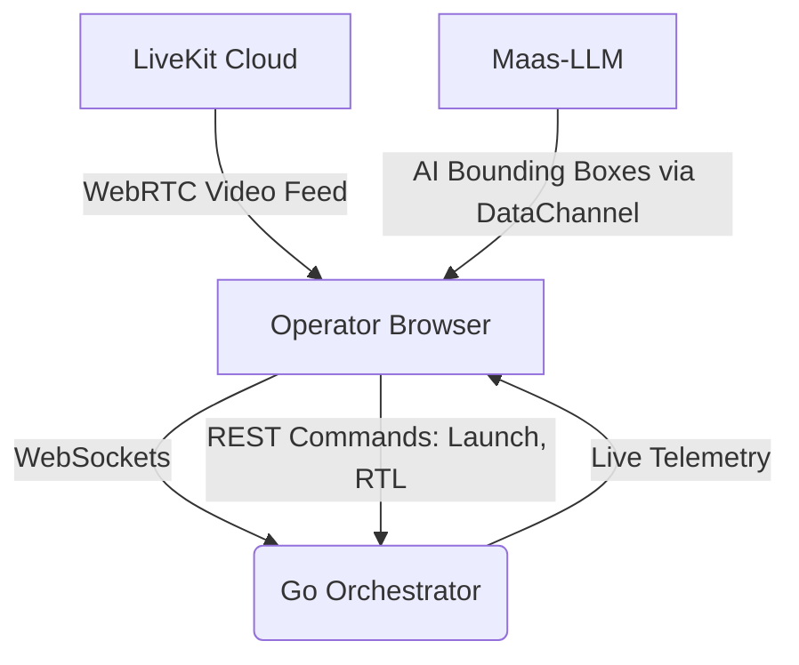

# MAAS Command Center (Frontend) 🗺️

## 🎯 Goal
The **Multi-Disaster Autonomous Aerial Swarm (MAAS) Frontend** is the operator's central command interface. Its goal is to provide a unified, low-latency dashboard for dispatching autonomous drone swarms to disaster zones, viewing real-time telemetry overlays, and monitoring live video feeds injected with AI anomaly detection (like fire and human detection).

## 🛠 Tech Stack
* **Framework:** Next.js (React)
* **Styling:** Tailwind CSS + Radix UI Primitives
* **Mapping:** Mapbox GL JS
* **Video/Audio Streaming:** LiveKit Components (WebRTC)
* **State Management:** Zustand
* **Deployment:** Vercel

## 🧩 Architecture Flow

## 🚀 Implementation Details
*   **Live WebRTC Grid:** Utilizes `@livekit/components-react` to dynamically render incoming drone video feeds in a responsive grid. The grid automatically scales based on the number of active drones in the swarm.
*   **Real-time AI Overlay:** The frontend listens to the LiveKit DataChannel. When the backend AI pipeline (`Maas-LLM`) detects an anomaly (e.g., a wildfire), it pushes a JSON payload through the DataChannel. The frontend parses this and instantly overlays dynamic bounding boxes (e.g., an orange "FIRE" square) directly on top of the live video stream.
*   **Mapbox Swarm Tracking:** A highly responsive 2.5D Mapbox implementation tracks the drone swarm globally. Live GPS coordinates received from the Orchestrator via WebSockets instantly update the drone markers on the map, providing the operator with pinpoint situational awareness.
*   **Zero-Trust Provisioning:** Features a secure "Provisioning Modal" that forces operators to claim edge nodes via a rotating 6-digit pair code before gaining access to the swarm controls.

## 🔗 Connected MAAS Repositories
The MAAS platform operates as a decoupled microservice architecture. Navigate the other components here:
* ☁️ **[Backend Orchestrator](https://github.com/sohail-kustagi/Multi-DisasterAutonomousAerialSwarm_backend)**
* 🧠 **[AI Pipeline (Maas-LLM)](https://github.com/sohail-kustagi/Maas-LLM)**
* 🛰️ **[Edge Middleware](https://github.com/sohail-kustagi/Maas-Middleware)**
